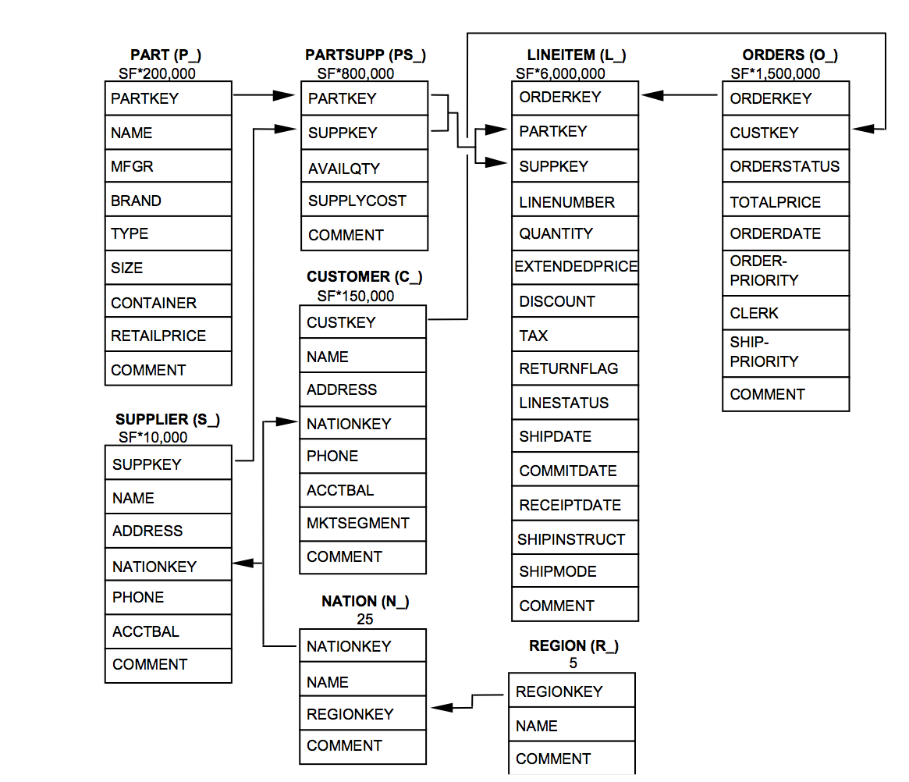

# Assignment 2, CMSC724, Spring 2016

*The assignment is to be done by yourself.*

This assignment focuses on understanding the ANALYZE capabilities provided by PostgreSQL. 
Like most other database systems, PostgreSQL allows you to analyze query execution plans, and tune the execution. 
The main PostgreSQL commands are EXPLAIN and EXPLAIN ANALYZE. The first one simply prints out 
the plan, but the second one also runs the query and compares the estimated values with 
actual values observed during execution.

An important accompanying command is `VACUUM ANALYZE`; this recalculates all the statistics
used by PostgreSQL optimizer.

The assignment here is to answer 5 questions using these tools. The questions are
present in the accompanying `assignment-analyze.sql` file. Most of the questions use
a modified TPC-H Benchmark database, more details are available at: [TPC-H](http://www.tpc.org/tpch)

